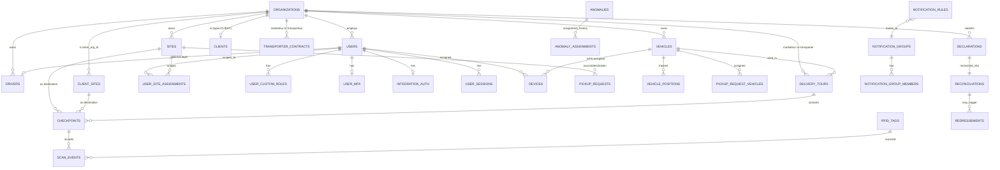

# 01 — Data Model (Schema v6.2, authoritative)

PostgreSQL 15 + PostGIS + TimescaleDB. All enums are UPPERCASE, no snake_case values. All geo columns are `GEOMETRY(POINT, 4326)` (note: TODO.md's target of `GEOGRAPHY(POINT,4326)` is **not** what the live SQL uses — flag this as a decision point, not an inconsistency to silently "fix").

## Enumerations (29 types)

| Enum | Values |
|---|---|
| `org_type` | REGULATEUR, DEPOT, MARKETEUR, TRANSPORTEUR, CLIENT |
| `region` | ADAMAOUA, CENTRE, EST, EXTREMENORD, LITTORAL, NORD, NORDOUEST, OUEST, SUD, SUDOUEST |
| `site_function` | CENTREEMPLISSEUR, ENTREPOT, POINTAPPROVISIONABLE (array column — a site can have multiple) |
| `site_status` | UNASSIGNED, ASSIGNED, ACTIVE, VERIFIED, SUSPENDED, REJECTED |
| `system_role` | SUPERADMIN, ADMIN, SUPERVISOR, INTEGRATEUR, AGENT, MARKETEUR, LIVREUR, TRANSPORTEUR |
| `vehicle_type` / `tournee_type` | VRAC, BOUTEILLES50KG |
| `execution_mode` | INTERNAL, EXTERNAL |
| `tournee_status` | DRAFT, PLANNED, PENDINGTRANSPORTERACK, ACKNOWLEDGED, INPROGRESS, CHECKPOINTACTIVE, CLOSED, CANCELLED |
| `checkpoint_status` | PENDING, REACHED, COMPLETED, SKIPPED |
| `scan_direction` | IN, OUT |
| `pickup_status` | DRAFT, VALIDATED, INPROGRESS, COMPLETED, CANCELLED |
| `declaration_status` | DRAFT, SUBMITTED, RECONCILED, DISPUTED |
| `reconciliation_status` | PENDING, VERIFIED, REDRESSEMENTAPPLIED |
| `redressement_status` | ISSUED, PAID, WAIVED |
| `device_type` | GPS, PDA, RFIDREADER |
| `device_status` | UNASSIGNED, ASSIGNED, INMISSION, OFFLINE, PENDINGSYNC, SYNCING, SYNCED, SYNCFAILED, MAINTENANCE, DEPLOYED, REMOVED, LOST |
| `rfid_tag_status` | AVAILABLE, ASSIGNEDTOBOTTLE, INTRANSITOUT, INTRANSITIN, LOST, BLOCKED |
| `risk_level` | FAIBLE, MODERE, ELEVE, CRITIQUE, CRITIQUEEXTREME |
| `risk_entity_type` | MARKETEUR, TRANSPORTEUR, LIVREUR, SITE, TOURNEE, CLIENT, CLIENTSITE, VEHICLE |
| `anomaly_category` | INVESTIGATION, TECHNICAL |
| `anomaly_type` | VOLUMEGAP, DEVIATIONROUTE, CHECKPOINTMISSED, SCANOUTOFSEQUENCE, SIPHONNAGE, SUBSTITUTIONBOUTEILLES, FALSIFICATIONPREUVES, FILLINGILLEGAL, DIVERSIONSUBSIDIES *(INVESTIGATION track)*; PDAUNSYNCED, BATTERYCRITICAL, GPSFAILURE, KAFKATIMEOUT, IOTDEGRADATION, SERVERUNAVAILABLE, TOURNEEUNASSIGNEDTOOLONG, TRANSPORTERNOACK, GPSREMOVED, DEVICEOFFLINE *(TECHNICAL track)* |
| `anomaly_status` | NOUVEAU, ENCOURS, RESOLU, FERME |
| `notification_group_type` | TECHNICAL, INVESTIGATION, ADMIN, MARKETING, TRANSPORT |
| `mfa_type` | TOTP, SMS, EMAIL |
| `mfa_status` | DISABLED, PENDINGSETUP, ENABLED, LOCKED |
| `audit_action` | LOGINSUCCESS, LOGINFAILURE, LOGOUT, TOKENREFRESH, PASSWORDRESET, MFAENABLED, MFADISABLED, MFACHALLENGEFAILED, MFACHALLENGESUCCESS, PERMISSIONDENIED, DATAEXPORT, BULKDELETE, DECLARATIONSUBMITTED, RECONCILIATIONVERIFIED, TOURNEECREATED, TOURNEEASSIGNED, TOURNEESENTTOTRANSPORTER, TOURNEEACKNOWLEDGED, TOURNEESTARTED, TOURNEECLOSED, VEHICLECERTIFICATEEXPIRED, SITESUSPENDED, CLIENTCREATED, SCANEVENTRECEIVED, PDASYNCBULKUPLOAD, ANOMALYRESOLVED, DEVICEREMOVED, GPSPOSITIONCAPTURED, SETTINGCHANGED |
| `report_format` | PDF, EXCEL, CSV, JSON |
| `report_status` | PENDING, GENERATING, READY, FAILED, EXPIRED |

## Table Catalog (40 tables, grouped by bounded context)

### A. Identity & RBAC

**`regions`** — static reference (10 rows, pre-seeded). `id, name, code (region, UNIQUE), created_at, updated_at`.

**`organizations`** — the tenant/actor table. `id, name, type (org_type), registration_number, tax_id, is_active, operational_site_count, client_site_count, vehicle_count, driver_count, user_count, created_at, updated_at, deleted_at, created_by→users, updated_by→users`.
- Note: the count columns (`operational_site_count`, etc.) are **denormalized counters**, not computed live — application code must keep them in sync on every create/delete of a related site/vehicle/driver/user.

**`users`** — `id, email (UNIQUE), password_hash, first_name, last_name, system_role (system_role), org_id→organizations, is_active, mfa_status (mfa_status), last_login_at, last_login_ip (INET), failed_login_count, locked_until, password_changed_at, must_change_password, created_at, updated_at, deleted_at, created_by→users(self), updated_by→users(self)`.

**`settings`** — key/value config catalog. `id, setting_key (UNIQUE), setting_value (TEXT), value_type, category, description, is_encrypted, min_value, max_value, requires_restart, created_at, updated_at, created_by, updated_by`. See `02_RBAC...` and `04_WORKFLOWS...` for the 11 mandatory keys and how each is consumed by triggers/business logic.

**`permissions`** — permission catalog. `id, code (UNIQUE), name, description, category, created_at`.

**`system_roles`** — metadata about each `system_role` value (hierarchy). `id, name (system_role, UNIQUE), description, hierarchy_level, can_create_subroles, can_assign_roles, max_subordinate_level, created_at, updated_at`.

**`system_role_permissions`** — join table `system_role_id↔permission_id`, unique pair.

**`user_mfa`** — one row per user (`user_id UNIQUE`). `mfa_type, secret_encrypted, backup_codes_hash TEXT[], is_enabled, verified_at`.

**`integration_auth`** — API/device auth for INTEGRATEUR-managed integrations. `user_id UNIQUE, auth_key_hash, certificate_pem, certificate_expiry, allowed_ip_ranges INET[], last_auth_at, auth_success_count, auth_failure_count, is_active`.

**`user_sessions`** — `user_id, refresh_token_hash, ip_address (INET), user_agent, geo_country, geo_city, geo_point (GEOMETRY POINT 4326), is_valid, is_mfa_verified, last_active_at, expires_at, created_at`.

**`audit_logs`** *(TimescaleDB hypertable on `created_at`, 7-day chunks, compressed after 30d, retained 5y)* — `id, user_id, session_id (no FK — see note below), action (audit_action), resource_table, resource_id, field_name, old_value (JSONB), new_value (JSONB), ip_address (INET NOT NULL), user_agent, request_id, risk_score, created_at`. PK is composite `(id, created_at)` because it's a hypertable.
- `session_id` intentionally has **no FK** — validated at application layer only (documented reasoning in SQL comments: hypertable composite-key FK would force expensive cross-chunk lookups).

**`custom_roles`** — org-scoped granular permission overrides. `id, org_id→organizations, name, description, permissions_json (JSONB), is_active, created_at, updated_at, deleted_at, created_by, updated_by`. Unique `(org_id, name)`.

**`user_custom_roles`** — `user_id, custom_role_id, site_id (optional scope)`. Unique `(user_id, custom_role_id, site_id)`.

### B. Sites & Clients

**`sites`** — operational sites (depots, filling centers, supply points), owned by an org. `id, org_id→organizations, region, name, functions (site_function[]), address, geo_point, geo_confidence_score (0-100), delivery_count, is_verified, verified_at, verified_by→users, status (site_status), reason, is_active, created_at, updated_at, deleted_at, created_by, updated_by`. Unique `(org_id, name)`. CHECK: `functions` array must be non-empty.

**`clients`** — commercial profile attached 1:1 to an organization of type CLIENT. `id, org_id→organizations (UNIQUE), primary_contact_name/phone/email, billing_address, payment_terms (days, default 30), credit_limit, tax_id, industry_sector, is_active, created_at, updated_at, deleted_at, created_by, updated_by`.

**`client_sites`** — delivery destinations for clients. `id, client_org_id→organizations, region, name, address, geo_point, geo_confidence_score, delivery_count, is_verified, verified_at, verified_by→users, status (site_status), current_marketeur_org_id→organizations (which marketeur currently supplies this site — "supplier switch" tracking), site_contact_name/phone, is_active, created_at, updated_at, deleted_at, created_by, updated_by`. Unique `(client_org_id, name)`.
- Note: the live SQL does **not** have a `clients.id` FK on `client_sites` (TODO.md proposes `client_id` FK to `clients` — not present in v6.2; `client_sites` links directly to the organization, not the `clients` profile row).

**`user_site_assignments`** — regional/site scoping for RBAC. `user_id→users, site_id→sites, is_primary, created_by, updated_by`. Unique `(user_id, site_id)`.
- Note: live SQL only scopes to `sites`, not `client_sites` (TODO.md's target CHECK "`exactly one of site_id or client_site_id`" does not exist in v6.2 — there is no `client_site_id` column here at all).

### C. Fleet & Devices

**`vehicles`** — `id, license_plate (UNIQUE), type (vehicle_type), org_id→organizations, max_volume (TM, VRAC only), max_bottle_count (BOUTEILLES50KG only), certificate_url, certificate_number, certificate_issued_at, certificate_expiry_at, tare_weight, is_active, created_at, updated_at, deleted_at, created_by, updated_by`.
- `chk_vehicle_vrac_cert`: VRAC vehicles must have `certificate_number` + `certificate_expiry_at`.
- `chk_vehicle_capacity`: exactly one of `max_volume`/`max_bottle_count`, matching `type`.

**`drivers`** — `id, first_name, last_name, license_number (UNIQUE), org_id→organizations, user_id→users (nullable — optional system login), is_active, created_at, updated_at, deleted_at, created_by, updated_by`.

**`devices`** — unified GPS/PDA/RFIDREADER registry. `id, serial_number (UNIQUE), device_type, status (device_status), firmware_version, battery_level (0-100), battery_critical (bool, trigger-maintained), last_sync, last_known_position (geo), assigned_to_user_id→users, assigned_to_vehicle_id→vehicles, org_id→organizations, config_json, metadata_json, created_at, updated_at, deleted_at, created_by, updated_by`.
- `chk_device_gps_imei`: GPS devices must carry `metadata_json->>'imei'`.
- Trigger `trg_devices_battery_critical` auto-sets `battery_critical` from `settings.device.battery_critical_threshold`.

**`device_status_history`** *(hypertable on `timestamp`, 7-day chunks, compressed 14d, retained 1y)* — `id, device_id→devices, old_status, new_status, reason, changed_by→users, geo_point, timestamp, created_at`.

**`vehicle_positions`** *(hypertable on `timestamp`, 1-day chunks, compressed 7d, retained 6mo)* — `id, vehicle_id→vehicles, device_id→devices, geo_point NOT NULL, speed, heading (0-360), accuracy, altitude, ignition_status, odometer, battery_level, timestamp, created_at`.

**`rfid_tags`** — `id, tag_id (UNIQUE), bottle_serial, status (rfid_tag_status), current_site_id→sites, current_client_site_id→client_sites, created_at, updated_at, deleted_at, created_by, updated_by`.
- `chk_rfid_bottle_serial`: format `^[A-Z0-9]{8,}$` when present.
- `chk_rfid_location`: at most one of `current_site_id`/`current_client_site_id` is set (both-null allowed = in transit / unassigned).

### D. Approvisionnement (Flux 1) & Livraison (Flux 2)

**`transporter_contracts`** — marketeur↔transporteur agreements. `id, marketeur_org_id→organizations, transporter_org_id→organizations, is_primary, contract_reference, started_at, ended_at, is_active, created_at, updated_at, deleted_at, created_by, updated_by`. Unique `(marketeur_org_id, transporter_org_id)`. CHECK: the two orgs must differ.
- Note: SQL has **no DB-level unique-partial-index enforcing only one `is_primary=true` per marketeur** — TODO.md calls this out as mandatory; it must be enforced either via a partial unique index (`WHERE is_primary`) or in application logic. **Gap to close.**

**`pickup_requests`** — `id, marketeur_org_id→organizations, source_site_id→sites, destination_site_id→sites, requested_quantity (>0), approved_quantity, status (pickup_status), created_at, updated_at, deleted_at, created_by, updated_by`. CHECK: source ≠ destination.

**`pickup_request_vehicles`** — join table. `pickup_request_id→pickup_requests, vehicle_id→vehicles`. Unique pair.

**`delivery_tours`** ("tournées") — `id, marketeur_org_id→organizations, execution_mode (INTERNAL/EXTERNAL), transporter_org_id→organizations (nullable), vehicle_id→vehicles, driver_id→drivers, livreur_user_id→users, assigned_by_transporter_user_id→users, transporter_assigned_at, type (tournee_type), status (tournee_status), requested_quantity (>0), loaded_quantity, delivered_quantity, started_at, closed_at, created_at, updated_at, deleted_at, created_by, updated_by`.
- `chk_tournee_internal`: INTERNAL ⇒ vehicle_id + driver_id + livreur_user_id all set.
- `chk_tournee_external`: EXTERNAL ⇒ transporter_org_id set.
- `chk_tournee_no_double_assign`: INTERNAL tours cannot have `assigned_by_transporter_user_id`.
- `chk_tournee_dates`: `started_at <= closed_at` when both present.

**`checkpoints`** — stops within a tour. `id, tournee_id→delivery_tours, site_id→sites (nullable), client_site_id→client_sites (nullable), sequence, expected_arrival, actual_arrival, status (checkpoint_status), skip_reason, created_at, updated_at, deleted_at, created_by, updated_by`. Unique `(tournee_id, sequence)`.
- `chk_checkpoint_exclusive`: exactly one of `site_id`/`client_site_id`.
- `chk_checkpoint_has_destination`: at least one is set (combined with above ⇒ exactly one).

**`scan_events`** *(hypertable on `timestamp`, 7-day chunks, compressed 30d, **retained 5 years** — primary evidentiary record)* — `id, checkpoint_id→checkpoints, livreur_user_id→users, rfid_tag_id→rfid_tags (nullable, bottles only), direction (IN/OUT), geo_point NOT NULL, timestamp, meter_reading (VRAC only), photo_url, pda_sync_id, conflict_status (free-text VARCHAR(20) — not an enum in live SQL), created_at, created_by`.
- Note: `scan_events` has **no `tour_id` or `device_id` column** in live SQL (TODO.md's target adds both directly) — the tour is only reachable via `checkpoint_id → checkpoints.tournee_id`. This is a real join-path consideration for any API/report.

### E. Péréquation (Declaration → Reconciliation → Redressement)

**`declarations`** — `id, marketeur_org_id→organizations, period_start, period_end (CHECK start<end), declared_volume (>=0), status (declaration_status), submitted_by→users, created_at, updated_at, deleted_at, created_by, updated_by`.

**`reconciliations`** — `id, declaration_id→declarations (UNIQUE — one reconciliation per declaration), tracked_volume (>=0), tracked_bottles_out, tracked_bottles_in, volume_gap (trigger-computed = declared − tracked), subsidy_impact, status (reconciliation_status), verified_by→users, verified_at, notes, created_at, updated_at, created_by, updated_by`.
- Note: live SQL has **no `gap_percentage` column** — must be computed in the app/report layer as `volume_gap / declared_volume`.

**`redressements`** — `id, reconciliation_id→reconciliations, amount (>=0), status (redressement_status), issued_at, due_date, paid_at (CHECK: only settable if status=PAID), transaction_ref, created_at, updated_at, created_by, updated_by`.
- Note: live SQL has no `currency` column (assume XAF implicitly) and no `waived_by`/`waive_reason` columns — TODO.md targets these; **gap to close** if waive audit trail is required.

**`risk_scores`** — polymorphic scoring. `id, entity_type (risk_entity_type), entity_id (UUID, no FK — polymorphic by design), score (0-100), level (risk_level), period_start, period_end (CHECK start<end), model_version, details_json, created_at, updated_at, created_by`.

### F. Anomalies & Notifications

**`anomalies`** — `id, type (anomaly_type), category (anomaly_category), severity (risk_level), status (anomaly_status), entity_type (risk_entity_type), entity_id (UUID, no FK), site_id→sites (nullable), client_site_id→client_sites (nullable), evidence_json, assigned_to_group (notification_group_type — direct enum, NOT an FK to notification_groups.id), created_at, updated_at, resolved_at, resolved_by→users, resolution_notes, created_by, updated_by`.
- CHECK: status RESOLU/FERME ⇒ `resolved_at` set.
- Note: `assigned_to_group` is the **enum type** (`TECHNICAL`/`INVESTIGATION`/`ADMIN`/`MARKETING`/`TRANSPORT`), not a foreign key to a specific `notification_groups.id` row — routing to an actual group happens via `notification_rules.target_group_id` lookup by `(anomaly_type, min_severity)`, not stored directly on the anomaly.

**`anomaly_assignments`** — reassignment history. `id, anomaly_id→anomalies, assigned_to_user_id→users, assigned_by_user_id→users, assigned_at, status (free-text), notes, resolved_at, created_at, updated_at`.

**`notification_groups`** — `id, name, type (notification_group_type), is_active, created_at, updated_at, deleted_at, created_by, updated_by`. Unique `(name, type)`.

**`notification_group_members`** — `group_id→notification_groups, user_id→users`. Unique pair.

**`notification_rules`** — `id, name, anomaly_type (anomaly_type), min_severity (risk_level), target_group_id→notification_groups, is_active, created_at, updated_at, deleted_at, created_by, updated_by`. Unique `(anomaly_type, min_severity)`.
- Note: live SQL has **no `escalation_hours`/`escalation_group_id`** columns (TODO.md target feature — not implemented).

### G. Reporting & Monitoring

**`reports`** — `id, name, type (free-text: OPERATIONAL/FINANCIAL/COMPLIANCE by convention), format (report_format), parameters_json, status (report_status), generated_at, file_url, file_size, generated_by→users, expires_at, created_at, updated_at, deleted_at, created_by, updated_by`.

**`monitoring_metrics`** *(hypertable on `timestamp`, 1-day chunks, compressed 3d, retained 90d)* — `id, metric_name, metric_value, metric_labels (JSONB), hostname, service_name, timestamp, created_at`. No FKs (free-text operational telemetry).

## Materialized Views

- **`mv_site_risk_summary`** — one row per non-deleted site, joined LATERAL to the latest `risk_scores` row where `entity_type='SITE'`. Unique index on `site_id` (enables `REFRESH ... CONCURRENTLY`).
- **`mv_marketeur_declaration_summary`** — one row per (marketeur × declaration), left-joined to its reconciliation. Unique index on `declaration_id`.
- Both are explicitly labeled in the SQL as **proposals** — the original view definitions referenced in earlier drafts were never supplied. Confirm against the real reporting requirements before treating these as final, and refresh them on a schedule (pg_cron or external scheduler), not per-write.

## Full-System Trigger Inventory

| Trigger | Table | Fires on | Effect |
|---|---|---|---|
| `trg_<table>_updated_at` (auto-generated for every table with `updated_at`) | all ~31 tables | BEFORE UPDATE | sets `updated_at = now()` |
| `trg_settings_audit` | `settings` | AFTER UPDATE (value changed) | writes an `audit_logs` row, action=`SETTINGCHANGED` |
| `trg_sites_autogeopromote` / `trg_client_sites_autogeopromote` | `sites`, `client_sites` | BEFORE INSERT/UPDATE OF `geo_confidence_score` | if score ≥ `settings.geo.confidence_auto_verify_threshold` and not yet verified → sets `is_verified=true`, `verified_at=now()` |
| `trg_reconciliations_compute_gap` | `reconciliations` | BEFORE INSERT/UPDATE OF `tracked_volume` | `volume_gap := declared_volume - tracked_volume` (declared volume pulled live from the linked `declarations` row) |
| `trg_devices_battery_critical` | `devices` | BEFORE INSERT/UPDATE OF `battery_level` | `battery_critical := battery_level <= settings.device.battery_critical_threshold` |

**Application-layer logic NOT covered by DB triggers** (must be implemented in the service layer — the schema deliberately keeps these out of the DB):
- Auto-promotion from `ACTIVE`→ requiring **both** `delivery_count ≥ 5` **and** confidence ≥ threshold (the DB trigger only checks confidence score, not delivery_count — this is a business-rule gap worth confirming against `04_WORKFLOWS_AND_FLUX.md §Site Verification`).
- `TRANSPORTERNOACK` / `TOURNEEUNASSIGNEDTOOLONG` anomaly auto-creation (time-based, needs a scheduler/cron, not a row-level trigger).
- `DEVICEOFFLINE` anomaly creation from `settings.device.offline_alert_minutes` (needs a scheduler comparing `last_sync` to now()).
- `VEHICLECERTIFICATEEXPIRED` anomaly (daily cron on `vehicles.certificate_expiry_at`).
- `delivered_quantity` computation on tour close (SUM of `scan_events` OUT−IN / meter readings, grouped through `checkpoints.tournee_id`).
- Risk score daily batch (2 AM) writing `risk_scores`.
- Reconciliation's `tracked_volume` population itself (summing `scan_events`) — the trigger only recomputes the *gap* once `tracked_volume` is set by the app.

## Settings Catalog (11 mandatory keys — all seeded in v6.2)

| Key | Default | Category | Consumed by |
|---|---|---|---|
| `geo.confidence_auto_verify_threshold` | 80 | GEOLOCATION | `autogeopromote()` trigger |
| `geo.confidence_flag_threshold` | 30 | GEOLOCATION | app-layer review-flag logic |
| `device.battery_critical_threshold` | 15 | DEVICE | `flag_device_battery_critical()` trigger |
| `device.offline_alert_minutes` | 30 | DEVICE | scheduler → `DEVICEOFFLINE` anomaly |
| `reconciliation.volume_gap_tolerance_percent` | 2.5 | RECONCILIATION | reconciliation review-flag logic |
| `tournee.transporter_ack_timeout_hours` | 4 | LOGISTICS | scheduler → `TRANSPORTERNOACK` anomaly |
| `tournee.unassigned_alert_hours` | 12 | LOGISTICS | scheduler → `TOURNEEUNASSIGNEDTOOLONG` anomaly |
| `audit.retention_years` | 5 | COMPLIANCE | TimescaleDB retention policy config |
| `mfa.enforced_for_roles` | ADMIN,SUPERADMIN,SUPERVISOR | SECURITY | login/session middleware |
| `gps.capture_interval_minutes` | 60 | GPS | vehicle position ingestion cadence |
| `report.default_expiry_days` | 30 | REPORTING | report generation worker |

Two additional keys appear seeded but not in TODO.md's "mandatory" list: `session.expiry_minutes` (480), `session.mfa_grace_minutes` (15), `auth.max_failed_login_attempts` (5), `auth.lockout_duration_minutes` (30) — these are real, live, and should be documented as first-class settings too.

## Entity Relationship Diagram (Mermaid)

## Seed Data Reality Check (from the 10 JSON files)

- Orgs: `org-0001` CSPH (REGULATEUR), `org-0002` SCTM, `org-0003` TotalEnergies, `org-0004` AZA Afrigaz, `org-0005` CAMGAZ, `org-0006` TRADEX, `org-0007` Neptune Gaz, `org-0008` STARGAS (7 MARKETEUR), `org-0009` SCDP (DEPOT), `org-0010`/`org-0011` transporteurs, `org-0012`–`org-0015` CLIENT orgs (hotel, clinic, food industry, pharmacy).
- `07_compliance.json` demonstrates the full péréquation lifecycle live: e.g. `decl-007-camgaz-oct2024` (DISPUTED, 10% gap) → `recon-007-camgaz-oct2024` (PENDING, 62,000 volume_gap, 31,000,000 XAF subsidy_impact) → `red-001-camgaz` (ISSUED, due in 15 days) — a real end-to-end fraud-flag example worth using as a fixture/test case.
- `risk_scores` in the seed data cover **every** `risk_entity_type` value (MARKETEUR, TOURNEE, CLIENTSITE, SITE, VEHICLE) — note `risk-008-pda-total-002` uses `entity_type: VEHICLE` for what is actually a PDA device (`dev-0012-pda-total-002`) — likely a seed-data labeling bug (should probably be a device-specific risk entity type, which doesn't currently exist in `risk_entity_type`). Worth flagging during implementation.
- `10_system_config.json` settings values match the SQL defaults exactly (good consistency signal). `rfid_tags` seed shows real `INTRANSITOUT` and `LOST` states in use. `custom_roles` seed shows real JSONB permission shapes like `{"tours.read": true, "tours.write": true}` — i.e., permission codes are `resource.action` dot-strings.
